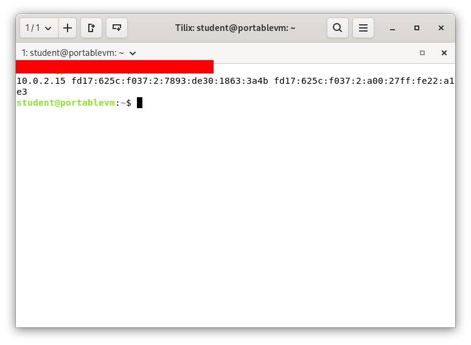

# Deliverable 2
## 1. What are the server hardware specifications (virtual machine settings)?
*This is just an example of a random vm settings*

## 2. What is the Debian Login Screen?
*This is just an old example. It should give you an idea of what I am looking for*

## 3. What is the IP address of your Debian Server Virtual Machine? 

## 4. How do you work with the Firewall in Debian? **(Type and explain what each command does)**
   1. **How do you check if the Firewall is running?**
      1.  By using the command `comand here`
   2. **How do you disable the Firewall?** 
      1. By using the command `command here`
   3. **How do you add Apache to the Firewall?** 
      1. By using the command `command here`
1. What different commands do we use to work with Apache? **(Type and explain what each command does and include a screenshot!)**
   1.  What is the command you use to check if Apache is running?
   2.  What is the command you use to stop Apache?
   3.  What is the command you use to restart Apache?
   4.  What is the command used to test Apache configuration?
   5.  What is the command used to check the installed version of Apache?
   6.  What are some common configuration files for Apache?
   7.  Where does Apache store logs?
   8.  What are some basic commands we can use to review logs?
2. Not all the answers are in the guide. Some researching and testing is required
3. Make sure the screenshots are properly formatted. Not too big and not too small. Use either a resizing tool or HTML.
