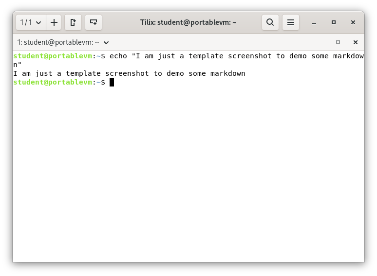

# Deliverable 2
## 1. What are the server hardware specifications (virtual machine settings)?
*This is just an example of a random vm settings*

## 2. What is the Debian Login Screen?
*This is just an old example. It should give you an idea of what I am looking for*

## 3. What is the IP address of your Debian Server Virtual Machine? 

## 4. How do you work with the Firewall in Debian? **(Type and explain what each command does)**

### Command name
* **Description**: Est pariatur sint fugiat mollit ea est veniam proident nulla laboris excepteur.
* **Formula**/**Syntaxt**: `command` + `option` + `argument` 
* **Examples**:
  * How do you check if the Firewall is running?
    * By using the command `comand here`
  * How do you disable the Firewall?
    * By using the command `command here`
  * How do you add Apache to the Firewall?
    * By using the command `command here`

## 5. What different commands do we use to work with Apache? **(Type the command and include a screenshot!)**

**1.  What is the command you use to check if Apache is running?**
* The command is: `command here`

**2.  What is the command you use to stop Apache?**
* The command is: `command here`

**3.  What is the command you use to restart Apache?**
* The command is: `command here`

**4.  What is the command used to test Apache configuration?**
* The command is: `command here`

**5.  What is the command used to check the installed version of Apache?**
* The command is: `command here`

**6.  What are some common configuration files for Apache?**
* The command is: `command here`

**7.  Where does Apache store logs?**
* The command is: `command here`

**8.  What are some basic commands we can use to review logs?**
* The command is: `command here`

