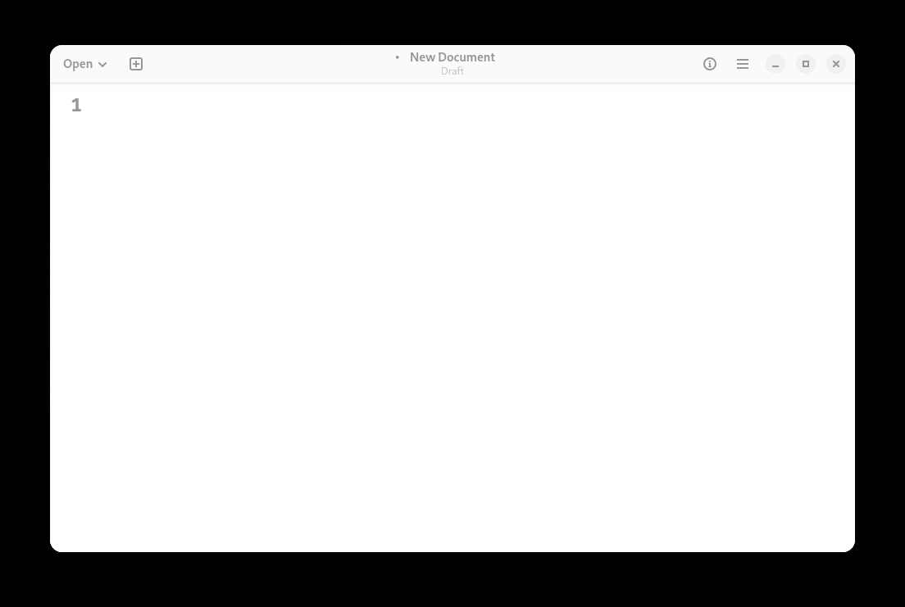

# Notes 4

## How to install and remove software using the APT command

Exercitation est amet mollit nisi nostrud cupidatat excepteur aute veniam mollit. Mollit excepteur officia deserunt mollit cupidatat anim minim enim nostrud. Amet esse aute amet velit cillum deserunt duis tempor exercitation commodo.

* `command 1`
* `Command 2`
* `Command 3`

## How to create a shell script 

### Step 1 Create the file
Ad pariatur proident amet aliqua Lorem. Quis commodo aliqua consequat eu minim. Adipisicing eiusmod exercitation eu eu tempor ad. Ullamco sint culpa anim quis deserunt deserunt ipsum cupidatat.

### Step 2 Add shell declaration
Ullamco proident deserunt aliqua adipisicing nulla irure est esse nulla excepteur est adipisicing. Ex pariatur exercitation amet eu. Consequat ullamco ipsum quis Lorem magna ea exercitation nisi nostrud anim enim irure. Eiusmod exercitation anim laborum reprehenderit fugiat commodo Lorem minim cillum ipsum tempor consectetur. Ullamco dolore et officia quis et adipisicing irure in culpa sint veniam Lorem fugiat pariatur.
### Step 3 Add your code
Lorem Lorem non enim sunt. Eiusmod aliquip sit amet eu veniam ullamco nulla incididunt fugiat labore. Sint nostrud ipsum voluptate incididunt ipsum eiusmod irure labore in esse eu ipsum in. Incididunt mollit velit ipsum in occaecat laborum cupidatat tempor.
## Step 4 Run the script
Ea nisi aute irure in cillum Lorem occaecat veniam. Mollit exercitation exercitation dolor et dolor tempor cupidatat. Ea ipsum et ea in veniam cillum consectetur proident officia adipisicing Lorem. In in nulla minim sunt in pariatur.

