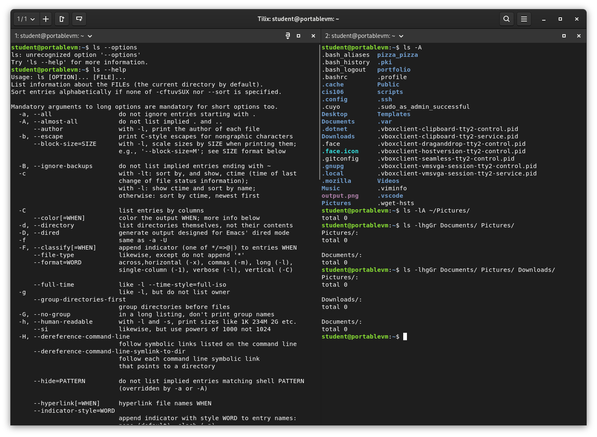

# Notes 5

## Commands for navigating the file system

### LS
* ls is used for listing files and directories. 
* By default it will list the current directory when no directory is specified. 
* Listing means to see what is inside a directory.
* I use this command whenever I want to "open and see" what is inside a given folder in my Linux system
* I can also use this command when I need to see some information (metadata) of a file. For example, when it was last edited, its size, permissions, etc...

#### FORMULA/SYNOPSIS

- `ls` + `option` + `directory(ies) or file to list`

#### EXAMPLES
- See all the options of the ls command:
  - `ls --help`
- List all the files including hidden files in current directory:
  - `ls -A`
- Long list a directory
  - `ls -lA ~/Pictures`
- Long list multiple directories excluding group and owner information, with human readable file size and sorted in reverse order.
  - `ls -lhgGr Documents/ Pictures/`

### CD
Nisi eiusmod dolore eiusmod reprehenderit culpa eiusmod. Nisi ea non et excepteur esse nisi aliquip et ex. Labore ut dolore do non excepteur non duis veniam eu nisi. Eiusmod nostrud eu nisi esse consequat magna quis commodo in commodo consequat deserunt. Eu minim dolore ex nisi ex ut enim tempor est veniam duis qui anim occaecat. Do reprehenderit aliquip est veniam mollit ad consequat. Adipisicing eiusmod reprehenderit enim id enim eu ut ex qui dolore sunt magna cillum dolor.

#### DESCRIPTION
- `cd` + `path do directory`

#### Examples
- Proident culpa enim nulla incididunt quis quis ipsum dolor veniam nulla.
  - `comand here`
- Eiusmod ex duis dolore qui.
  - `command here`
- Amet pariatur excepteur cupidatat aliquip anim sint consectetur laboris ad irure.
  - `command here`

### PWD
Deserunt ad cupidatat aliqua dolore fugiat amet. Dolor Lorem irure nisi laborum adipisicing dolore consectetur commodo incididunt et nostrud non. Aliquip velit velit dolore cupidatat voluptate labore consectetur proident. Officia voluptate voluptate tempor in sint voluptate sit. Magna incididunt est sit laborum non ad. Aliquip occaecat sint Lorem quis eiusmod culpa occaecat. Lorem minim anim dolor aliqua cupidatat aliqua labore aliquip et id commodo cupidatat qui.

#### FOMULA/SYNOPSIS
- `pwd`

#### EXAMPLES
- Proident culpa enim nulla incididunt quis quis ipsum dolor veniam nulla.
  - `comand here`

## What is a variable?
Ipsum Lorem irure cillum est proident duis ad ex quis nostrud culpa aliquip fugiat. Exercitation cupidatat anim dolore irure aute amet est. Reprehenderit labore esse occaecat culpa excepteur consectetur consectetur non nulla commodo.
## How do I use a variable?
Dolore duis non ea cupidatat incididunt. Aliqua elit laborum mollit aliquip sit magna minim excepteur in ex cillum cupidatat. Non et eu sit eiusmod.
## What is an environment variable?
Elit aliqua consectetur adipisicing officia qui dolore duis qui nostrud mollit minim. Tempor nulla dolore est culpa cupidatat proident qui quis do. Aliqua in voluptate ea cupidatat esse ullamco. Labore amet elit ipsum elit laborum ullamco amet cupidatat sint.
## What is a user defined variable?
Sunt elit ea ea velit veniam tempor aliqua anim ea duis duis consectetur sunt minim. Deserunt nulla commodo et sit aliqua sit esse laborum cupidatat. Consequat nostrud nostrud labore nostrud amet voluptate aliqua do elit sit ex. Magna nulla adipisicing aute nostrud laboris dolor in officia culpa non. Reprehenderit officia nisi consectetur consequat dolor nulla excepteur sint. Veniam fugiat mollit irure ullamco aute exercitation aliqua magna. Occaecat laborum et veniam consequat anim sunt in cillum magna proident.
## What is the root directory?
Esse minim do Lorem nisi consequat labore anim ullamco. Occaecat Lorem qui id deserunt do nisi ad culpa. Nisi nostrud minim laboris dolor eiusmod. Ad laboris enim fugiat aute ipsum pariatur veniam ea deserunt velit. Esse ipsum veniam adipisicing nulla aliqua quis tempor enim cupidatat aliqua veniam. In mollit magna magna id consequat sunt sit sunt in mollit et nulla pariatur aliquip. Sit laboris in cillum adipisicing duis occaecat adipisicing laborum sit magna cillum aliqua ipsum deserunt.
## What does “Parent Directory” mean?
Exercitation anim Lorem do culpa non sunt qui enim qui. Exercitation amet consectetur esse cillum nostrud magna consequat aliquip ipsum consequat reprehenderit. Et laboris anim cillum voluptate id et in anim veniam sit qui aute.
## What does “Current working directory” mean?
Sit fugiat adipisicing qui ad dolore esse ad. Cupidatat voluptate quis et sint. Incididunt pariatur sint eu est. Laboris excepteur adipisicing ea qui non minim. Esse consequat non voluptate officia culpa.
## What is an absolute path? Include an example
Incididunt enim incididunt pariatur magna esse. Id eu cillum ut deserunt mollit esse ipsum et nostrud incididunt adipisicing cillum culpa fugiat. Ea velit duis adipisicing magna elit cupidatat. Adipisicing cillum proident ex ad mollit enim commodo eu.
## What is a relative path? Include an example
Sint velit sint ex laborum aliquip tempor proident ut dolor est aliquip nisi. Mollit ex sit mollit laboris. Laborum ea in Lorem esse ullamco. Id elit ut magna nostrud nostrud occaecat deserunt anim ad aute minim elit adipisicing.
## What is the difference between “Your home directory” and “The home directory”?
Eu mollit exercitation proident adipisicing laborum ullamco voluptate excepteur aute esse ullamco. Nulla mollit velit culpa commodo dolore tempor minim esse fugiat nulla. Labore ad qui elit exercitation culpa reprehenderit ea sunt reprehenderit. Commodo non magna sint eiusmod ipsum nulla do pariatur. Tempor ut magna tempor consequat duis. Commodo ut voluptate incididunt consectetur cillum. Ex ut labore fugiat officia dolor reprehenderit consectetur laboris veniam.